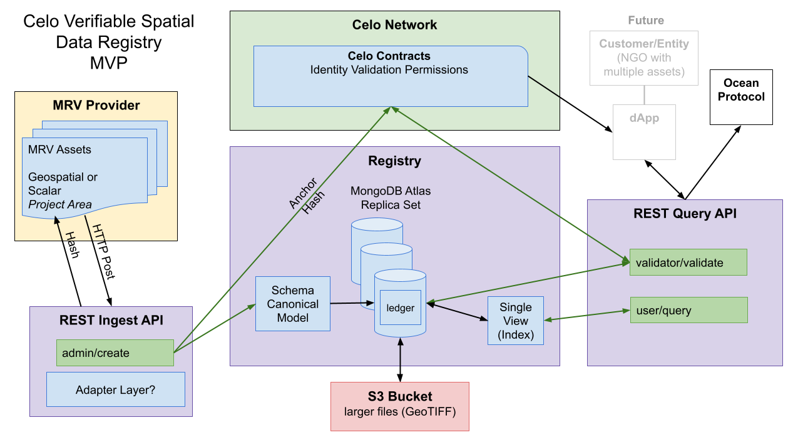

# openmrv-server

### Requirements 
- [MongoDB v6](https://www.mongodb.com/docs/manual/administration/install-enterprise) (local test instance)
- [MongoDB Atlas](https://www.mongodb.com/basics/mongodb-atlas-tutorial) (production)
### Nice to have 
- [MongoDB Compass](https://www.mongodb.com/products/compass)

# Project setup
## logger init:
```sh
sudo mkdir /var/log/openmrv-server
sudo chown -R $USER.$USER /var/log/openmrv-server
```
## .env:
```sh
cp .env.sample .env
# provide appropriate values in .env
```
## load base test data and run tests:
```sh
npm i
npm run testbasedata
npm run test
```
## run anchor test:
```sh
# clone the contract repo to same level as openmrv-server
git clone https://github.com/MRV-Studio/openmrv-contract.git
cd openmrv-contract
npm i -g yarn
yarn test
cp deployments/deployments.json ../openmrv-server/src
# start celo local instance
yarn localnode
# new terminal, run anchor test
cd openmrv-server
npm run testanchor
# summarizes raw data hashes to anchor hash, stores on celo contract, stores both anchor hash and transaction hash on mongo for subsequent validation
# uses wallet from first autogenerated test account private key, see .env.sample and add to .env
```

### Load sample data
- [Kaggle weather sample](https://www.kaggle.com/datasets/rober2598/madrid-weather-dataset-by-hours-20192022)

```sh
# imports first 744 rows of sample to localhost/test
mongoimport --uri mongodb://localhost:27017/test --file data/sample/weather_madrid_2019-2022.csv --type csv --collection sample_weather_source --headerline --drop

# transforms to timeseries collection
mongosh mongodb://localhost:27017/test -f scripts/init_database.js
mongosh mongodb://localhost:27017/test -f scripts/load_database.js
```
